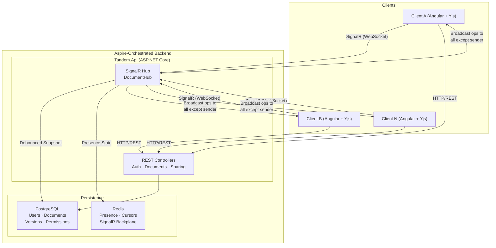

# Tandem — Real-Time Collaborative Document Editor

A Google Docs-style editor where multiple users edit the same document simultaneously with live cursors, presence indicators, and zero lost keystrokes — built on ASP.NET + Aspire, Angular, SignalR, and PostgreSQL.

## System Architecture



## Key Design Decision: Yjs + SignalR (Not OT from Scratch)

We will **not** reinvent CRDT/OT theory. Instead:

- **Client-side:** Use **Yjs** (the industry-standard CRDT library) with a **custom SignalR provider** that replaces the default `y-websocket` provider. Each Angular client maintains a local `Y.Doc` instance; the CRDT math guarantees convergence.
- **Server-side:** The SignalR Hub acts as a **relay** — it receives binary Yjs update blobs from one client and broadcasts them to all others in the same document group. Optionally, we use **YDotNet** (the .NET binding for Rust's `yrs`) for server-side state management and persistence.
- **Persistence:** Debounced snapshotting to PostgreSQL (not on every keystroke). The full Yjs binary state vector is stored as a `bytea` column, enabling instant document reconstruction when a new client connects.

> [!IMPORTANT]
> Our engineering value-add is the **sync protocol over SignalR**, the **persistence strategy**, the **presence system**, and the **polished production UI** — not reinventing conflict resolution.

---

## Tech Stack

| Layer | Technology | Purpose |
|:---|:---|:---|
| **Frontend** | Angular 19+ (standalone) | SPA framework |
| **Rich Text Editor** | Tiptap (`@tiptap/angular`) + ProseMirror | Headless rich text editing |
| **CRDT** | Yjs (`yjs`) + custom SignalR provider | Conflict-free replicated data types |
| **Real-Time** | SignalR (`@microsoft/signalr` client + ASP.NET Core Hub) | WebSocket transport for CRDT ops & presence |
| **Backend** | ASP.NET Core (.NET 10) Minimal API | REST API + SignalR Hub hosting |
| **Orchestration** | .NET Aspire 13.x | Local dev orchestration, service discovery, telemetry |
| **Database** | PostgreSQL (via `Aspire.Hosting.PostgreSQL`) | Document metadata, user data, version history, Yjs snapshots |
| **Cache / Backplane** | Redis (via `Aspire.Hosting.Redis`) | SignalR backplane for scale-out, ephemeral presence/cursor state |
| **Auth** | ASP.NET Core Identity + JWT Bearer | Registration, login, per-document share permissions |
| **ORM** | Entity Framework Core + Npgsql | Database access |

---

## Proposed Changes

### Phase 1: Foundation — Backend Scaffolding & Database (Day 1–2)

---

#### Aspire Orchestration (`Tandem.AppHost`)

##### [MODIFY] [AppHost.cs](file:///d:/_mine/_repos/tandem/backend/Tandem.AppHost/AppHost.cs)

Wire up all resources: PostgreSQL, Redis, Angular frontend, and the API project.

```csharp
var builder = DistributedApplication.CreateBuilder(args);

var postgres = builder.AddPostgres("postgres")
    .WithDataVolume()
    .WithPgAdmin();

var tandemDb = postgres.AddDatabase("tandemdb");

var redis = builder.AddRedis("redis")
    .WithRedisInsight();

var api = builder.AddProject<Projects.Tandem_Api>("api")
    .WithReference(tandemDb)
    .WaitFor(tandemDb)
    .WithReference(redis)
    .WaitFor(redis);

builder.AddNpmApp("frontend", "../../frontend", "start")
    .WithReference(api)
    .WaitFor(api)
    .WithHttpEndpoint(env: "PORT")
    .WithExternalHttpEndpoints();

builder.Build().Run();
```

##### [MODIFY] [Tandem.AppHost.csproj](file:///d:/_mine/_repos/tandem/backend/Tandem.AppHost/Tandem.AppHost.csproj)

Add Aspire hosting integrations:
- `Aspire.Hosting.PostgreSQL`
- `Aspire.Hosting.Redis`
- `Aspire.Hosting.NodeJs`
- Project reference to `Tandem.Api`

---

#### API Project

##### [NEW] `backend/Tandem.Api/Tandem.Api.csproj`

ASP.NET Core Web API project targeting .NET 10 with packages:
- `Aspire.Npgsql.EntityFrameworkCore.PostgreSQL`
- `Aspire.StackExchange.Redis`
- `Microsoft.AspNetCore.SignalR.StackExchangeRedis` (backplane)
- `Microsoft.AspNetCore.Identity.EntityFrameworkCore`
- `Microsoft.AspNetCore.Authentication.JwtBearer`
- `YDotNet` + `YDotNet.Server` (server-side CRDT state management)

##### [NEW] `backend/Tandem.Api/Program.cs`

Minimal API entry point configuring:
- Service defaults (Aspire telemetry, health checks)
- EF Core with Npgsql (Aspire integration: `builder.AddNpgsqlDbContext<TandemDbContext>("tandemdb")`)
- Redis (Aspire integration: `builder.AddRedisClient("redis")`)
- ASP.NET Core Identity with EF stores
- JWT Bearer authentication
- SignalR with Redis backplane
- CORS policy for the Angular frontend
- Endpoint mapping: REST controllers + SignalR Hub

---

#### Domain & Data Layer

##### [NEW] `backend/Tandem.Api/Data/TandemDbContext.cs`

EF Core DbContext with entity sets:
- `Users` (ASP.NET Identity `ApplicationUser`)
- `Documents`
- `DocumentVersions`
- `DocumentPermissions`

##### [NEW] `backend/Tandem.Api/Data/Entities/`

| Entity | Key Fields |
|:---|:---|
| `ApplicationUser` : `IdentityUser` | `DisplayName`, `AvatarColor` |
| `Document` | `Id`, `Title`, `OwnerId`, `YjsState` (`byte[]`), `CreatedAt`, `UpdatedAt` |
| `DocumentVersion` | `Id`, `DocumentId`, `YjsSnapshot` (`byte[]`), `VersionNumber`, `CreatedAt`, `CreatedByUserId` |
| `DocumentPermission` | `Id`, `DocumentId`, `UserId`, `Role` (enum: `Viewer`, `Editor`) |

##### [NEW] `backend/Tandem.Api/Data/Migrations/` 

Initial EF Core migration for the schema above.

---

#### Auth Endpoints

##### [NEW] `backend/Tandem.Api/Endpoints/AuthEndpoints.cs`

Minimal API endpoint group:
- `POST /api/auth/register` — Create user, return JWT
- `POST /api/auth/login` — Validate credentials, return JWT + refresh token
- `POST /api/auth/refresh` — Refresh token rotation
- `GET /api/auth/me` — Current user profile

---

### Phase 2: Document CRUD & REST API (Day 2–3)

---

##### [NEW] `backend/Tandem.Api/Endpoints/DocumentEndpoints.cs`

- `GET /api/documents` — List documents accessible to current user (owned + shared)
- `POST /api/documents` — Create new document (initializes empty Yjs state)
- `GET /api/documents/{id}` — Get document metadata (title, owner, permissions)
- `PUT /api/documents/{id}` — Update document metadata (title)
- `DELETE /api/documents/{id}` — Soft-delete document (owner only)
- `GET /api/documents/{id}/versions` — List version snapshots
- `GET /api/documents/{id}/versions/{versionId}` — Retrieve a specific version snapshot

##### [NEW] `backend/Tandem.Api/Endpoints/SharingEndpoints.cs`

- `POST /api/documents/{id}/share` — Share document with user (by email), assign role
- `PUT /api/documents/{id}/share/{userId}` — Update share role
- `DELETE /api/documents/{id}/share/{userId}` — Revoke access
- `GET /api/documents/{id}/share` — List current shares

---

### Phase 3: SignalR Hub & Yjs Sync Protocol (Day 3–4)

---

##### [NEW] `backend/Tandem.Api/Hubs/DocumentHub.cs`

The core real-time hub with these server methods:

```csharp
public class DocumentHub : Hub
{
    // Client joins a document room
    public async Task JoinDocument(string documentId)
    {
        // Validate permissions via JWT claims
        // Add connection to SignalR group: documentId
        // Send current Yjs state vector to joining client
        // Broadcast presence update (user joined)
    }

    // Client sends a Yjs update (binary CRDT diff)
    public async Task SendYjsUpdate(string documentId, byte[] update)
    {
        // Apply update to server-side YDotNet doc (for persistence)
        // Broadcast to OthersInGroup(documentId)
        // Debounce: schedule snapshot save to PostgreSQL
    }

    // Client sends awareness/presence update (cursor, selection)
    public async Task SendAwareness(string documentId, byte[] awarenessUpdate)
    {
        // Store in Redis (ephemeral)
        // Broadcast to OthersInGroup(documentId)
    }

    // Client leaves
    public override async Task OnDisconnectedAsync(Exception? exception)
    {
        // Remove from group
        // Broadcast presence update (user left)
        // Clean up Redis presence entry
    }
}
```

##### [NEW] `backend/Tandem.Api/Services/DocumentSyncService.cs`

Server-side document state manager:
- Maintains in-memory `YDotNet.Document` instances per active document (loaded from PostgreSQL on first connection)
- Applies incoming Yjs updates to the server copy
- **Debounced persistence**: After N seconds of inactivity (e.g., 3s), snapshot the full Yjs state to `Document.YjsState` in PostgreSQL
- **Version snapshots**: Every M updates or on explicit save, create a `DocumentVersion` row
- Evicts idle documents from memory after timeout

##### [NEW] `backend/Tandem.Api/Services/PresenceService.cs`

Manages ephemeral presence via Redis:
- Tracks who is online in each document (user ID, display name, avatar color)
- Tracks cursor positions and selections per user
- Uses Redis hashes keyed by `presence:{documentId}` with per-user fields
- TTL-based cleanup for stale entries

---

### Phase 4: Angular Frontend Scaffolding (Day 1–2, parallel)

---

##### [NEW] `frontend/` — Angular 19 standalone app

Scaffold with Angular CLI:
```bash
npx -y @angular/cli@latest new frontend --style=scss --routing --ssr=false --standalone
```

Key structure:
```
frontend/
├── src/
│   ├── app/
│   │   ├── core/
│   │   │   ├── auth/            # AuthService, AuthGuard, JWT interceptor
│   │   │   ├── services/        # SignalR service, Document API service
│   │   │   └── models/          # TypeScript interfaces
│   │   ├── features/
│   │   │   ├── auth/            # Login & Register pages
│   │   │   ├── dashboard/       # Document list / home page
│   │   │   └── editor/          # The collaborative editor page
│   │   ├── shared/              # Shared components (toolbar, avatar, etc.)
│   │   └── app.routes.ts
│   └── styles/                  # Global SCSS, design tokens
```

---

### Phase 5: Collaborative Editor — The Core Feature (Day 3–5)

---

##### [NEW] `frontend/src/app/core/services/signalr.service.ts`

Singleton Angular service wrapping `@microsoft/signalr`:
- `connect(documentId)` — Build `HubConnection` with JWT access token factory, connect to `/hubs/document`
- `joinDocument(documentId)` — Invoke `JoinDocument` on hub
- `sendYjsUpdate(documentId, update: Uint8Array)` — Invoke `SendYjsUpdate`
- `sendAwareness(documentId, update: Uint8Array)` — Invoke `SendAwareness`
- `onYjsUpdate(callback)` — Register `ReceiveYjsUpdate` handler
- `onAwareness(callback)` — Register `ReceiveAwareness` handler
- `onPresence(callback)` — Register `ReceivePresence` handler
- `disconnect()` — Stop connection, clean up

##### [NEW] `frontend/src/app/core/services/yjs-signalr.provider.ts`

**Custom Yjs Provider** — the bridge between Yjs and SignalR:

```typescript
import * as Y from 'yjs';
import { Awareness } from 'y-protocols/awareness';
import { SignalRService } from './signalr.service';

export class SignalRProvider {
  doc: Y.Doc;
  awareness: Awareness;
  
  constructor(
    private documentId: string,
    doc: Y.Doc,
    private signalr: SignalRService
  ) {
    this.doc = doc;
    this.awareness = new Awareness(doc);
    
    // When local Yjs doc changes → send update via SignalR
    doc.on('update', (update: Uint8Array, origin: any) => {
      if (origin !== 'remote') {
        this.signalr.sendYjsUpdate(this.documentId, update);
      }
    });
    
    // When SignalR receives remote update → apply to local doc
    this.signalr.onYjsUpdate((update: Uint8Array) => {
      Y.applyUpdate(this.doc, update, 'remote');
    });
    
    // Awareness (cursor/presence) sync
    this.awareness.on('update', ({ added, updated, removed }) => {
      const update = Awareness.encodeAwarenessUpdate(this.awareness, [...added, ...updated, ...removed]);
      this.signalr.sendAwareness(this.documentId, update);
    });
    
    this.signalr.onAwareness((update: Uint8Array) => {
      Awareness.applyAwarenessUpdate(this.awareness, update, 'remote');
    });
  }
}
```

##### [NEW] `frontend/src/app/features/editor/editor.component.ts`

The main editor page component:
- Initializes `Y.Doc`, `SignalRProvider`, and Tiptap editor instance
- Wires Tiptap to Yjs via `@tiptap/extension-collaboration` and `@tiptap/extension-collaboration-cursor`
- Displays the toolbar (bold, italic, headings, lists, etc.)
- Shows live presence panel (avatars + names of connected users)
- Shows remote cursors with user-specific colors and name labels
- Handles document loading (initial state from SignalR `JoinDocument` response)

##### [NEW] `frontend/src/app/features/editor/toolbar/`

Rich text toolbar component with Tiptap commands:
- Text formatting (bold, italic, underline, strikethrough, code)
- Headings (H1–H3)
- Lists (bullet, ordered, task list)
- Block elements (blockquote, code block, horizontal rule)
- Undo/redo

##### [NEW] `frontend/src/app/features/editor/presence-panel/`

Sidebar or header component showing:
- Avatars of all connected users (colored circles with initials)
- Online/offline indicators
- "N users editing" count

---

### Phase 6: Auth UI & Dashboard (Day 5–6)

---

##### [NEW] `frontend/src/app/features/auth/login/` & `register/`

- Modern login/register forms with validation
- JWT storage in `localStorage` (or `sessionStorage`)
- Auto-redirect on successful auth

##### [NEW] `frontend/src/app/features/dashboard/dashboard.component.ts`

Document management dashboard:
- List of user's documents (owned + shared with them)
- "New Document" button
- Document cards showing: title, last edited date, owner, collaborator avatars
- Share dialog (invite by email, set role: viewer/editor)
- Delete document (with confirmation)

##### [NEW] `frontend/src/app/core/auth/auth.interceptor.ts`

HTTP interceptor that attaches `Authorization: Bearer <token>` to all API requests.

##### [NEW] `frontend/src/app/core/auth/auth.guard.ts`

Route guard that redirects unauthenticated users to login.

---

### Phase 7: Version History & Sharing (Day 6–7)

---

##### [NEW] `frontend/src/app/features/editor/version-history/`

Slide-out panel accessible from the editor:
- Lists version snapshots with timestamps and author
- Click a version to preview it (read-only rendered Tiptap view)
- "Restore this version" button (creates a new Yjs state from the snapshot)

##### [NEW] `frontend/src/app/features/editor/share-dialog/`

Modal dialog for managing document access:
- Search/invite users by email
- Role dropdown (Viewer / Editor)
- Copy shareable link
- List current collaborators with remove option

---

### Phase 8: Polish & Production Readiness (Day 7–8)

---

#### UI/UX Polish
- **Dark mode** with glassmorphism effects (frosted glass toolbar, subtle shadows)
- **Smooth animations** — page transitions, toolbar hover states, cursor animations
- **Google Fonts** — Inter or Outfit for a premium feel
- **Responsive design** — works on desktop and tablet
- **Loading states** — skeleton screens, connection status indicator
- **Toast notifications** — user joined/left, document saved, share invite sent
- **Keyboard shortcuts** — Ctrl+S (force save), Ctrl+B/I/U, etc.

#### Backend Hardening
- Rate limiting on auth endpoints
- Input validation with FluentValidation
- Global error handling middleware
- Structured logging via Aspire/OpenTelemetry
- SignalR connection authorization (validate JWT on hub connect, validate document permissions per group)

---

## Open Questions

> [!IMPORTANT]
> **Angular version**: Your current projects use Angular. Do you have a preferred Angular version (e.g., 18, 19)? The plan assumes Angular 19+ with standalone components and signals.

> [!IMPORTANT]
> **Auth complexity**: The plan uses ASP.NET Core Identity + JWT for auth. Would you prefer an external IdP (Keycloak, Auth0, etc.) instead, or is self-contained Identity sufficient?

> [!IMPORTANT]
> **Deployment target**: The plan focuses on local development with Aspire. Do you have a specific deployment target in mind (Azure Container Apps, Railway, Fly.io, self-hosted Docker)? This affects how we configure the SignalR backplane and persistence.

> [!IMPORTANT]
> **Scope for initial implementation**: Do you want me to build all 8 phases, or would you prefer to start with a smaller scope (e.g., Phases 1–5: the core collaborative editing without auth/sharing/versioning) and iterate?

---

## Verification Plan

### Automated Tests

- **Backend unit tests** (`Tandem.Api.Tests`): Service-layer tests for document CRUD, permission checks, debounced persistence logic
- **Backend integration tests**: EF Core in-memory/test containers for database operations, SignalR hub integration tests
- **Frontend unit tests**: Karma/Jest tests for services (SignalR service, auth service) and components

### Manual Verification

- **The 10-second demo**: Open two browser tabs, type in both, watch them sync in real-time with visible remote cursors
- **Conflict test**: Both users type in the exact same position simultaneously — no lost keystrokes
- **Presence test**: Open/close tabs and verify avatar indicators update live
- **Persistence test**: Edit a document, close all tabs, reopen — all changes preserved
- **Permission test**: Share as viewer → verify read-only; share as editor → verify editing works
- **Version history test**: Make edits, view version history, restore an older version

### Build Verification

```bash
# Backend
cd backend
dotnet build Tandem.slnx
dotnet test

# Frontend  
cd frontend
npm run build
npm run test
```
